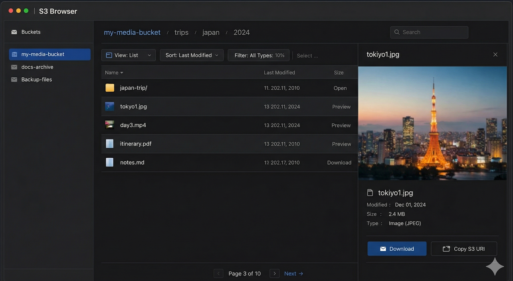

# S3 Browser

A clean, modern web UI for browsing private Amazon S3 buckets. Think of it as a read-only Google Drive or Finder experience for your S3 content.



## Features

- **Bucket Navigation** - Browse all accessible S3 buckets from a sidebar
- **File Explorer** - Navigate folders/prefixes like a local file system with breadcrumb navigation
- **Image Preview** - View JPG, PNG, GIF, WebP, and SVG images inline
- **Video Preview** - Play MP4, WebM, and MOV videos directly in the browser
- **Fullscreen Lightbox** - Click any image/video to view it fullscreen
- **Search** - Find files across the entire bucket with instant search
- **Deep Links** - Share direct links to files: `/?uri=s3://bucket/path/file.jpg`
- **Pagination** - Handle large buckets with paginated listing
- **Sorting** - Sort by name, date modified, or size
- **Dark/Light Mode** - Toggle between themes or follow system preference
- **Secure** - Uses pre-signed URLs; your buckets stay private

## Quick Start

### Using Docker (Recommended)

1. Create a `.env` file with your AWS credentials:

```env
AWS_ACCESS_KEY_ID=your-access-key
AWS_SECRET_ACCESS_KEY=your-secret-key
AWS_REGION=us-east-1
```

2. Run with Docker Compose:

```bash
docker compose up -d
```

3. Open http://localhost:3005 in your browser

### Manual Installation

Requirements: Node.js 18+

```bash
# Install dependencies
npm install

# Build all packages
npm run build

# Start the server
npm start
```

The app will be available at http://localhost:3001

### Development Mode

```bash
# Run both client and server in dev mode with hot reload
npm run dev
```

- Client: http://localhost:5173
- Server: http://localhost:3001

## Configuration

### Environment Variables

| Variable | Required | Default | Description |
|----------|----------|---------|-------------|
| `AWS_ACCESS_KEY_ID` | Yes | - | AWS access key |
| `AWS_SECRET_ACCESS_KEY` | Yes | - | AWS secret key |
| `AWS_REGION` | No | `us-east-1` | Default AWS region |
| `AWS_SESSION_TOKEN` | No | - | Session token (for temporary credentials) |
| `S3BROWSER_BUCKET_ALLOWLIST` | No | - | Comma-separated list of allowed buckets |
| `S3BROWSER_PRESIGN_TTL_SECONDS` | No | `900` | Pre-signed URL expiration (seconds) |
| `PORT` | No | `3001` | Server port |

### Bucket Allowlist

For security, you can restrict which buckets are accessible:

```env
S3BROWSER_BUCKET_ALLOWLIST=my-media-bucket,my-docs-bucket
```

## Deep Links

Share direct links to files or folders:

```
# Link to a specific file (opens preview)
http://localhost:3005/?uri=s3://my-bucket/photos/vacation/beach.jpg

# Link to a folder
http://localhost:3005/?uri=s3://my-bucket/photos/vacation/

# Link to a bucket root
http://localhost:3005/?uri=s3://my-bucket
```

## Tech Stack

- **Frontend**: React, TypeScript, Vite, Tailwind CSS, TanStack Query
- **Backend**: Node.js, Express, TypeScript
- **AWS**: @aws-sdk/client-s3, @aws-sdk/s3-request-presigner
- **Icons**: Phosphor Icons
- **State**: Zustand

## Project Structure

```
s3-browser/
├── client/          # React frontend
│   ├── src/
│   │   ├── api/         # API client
│   │   ├── components/  # React components
│   │   ├── hooks/       # Custom hooks
│   │   └── store/       # Zustand stores
│   └── ...
├── server/          # Express backend
│   ├── src/
│   │   ├── routes/      # API routes
│   │   └── services/    # S3 service layer
│   └── ...
├── shared/          # Shared types and utilities
├── docs/            # Documentation and UI mockups
├── scripts/         # Utility scripts
├── Dockerfile
└── docker-compose.yml
```

## API Endpoints

| Method | Endpoint | Description |
|--------|----------|-------------|
| GET | `/api/buckets` | List all accessible buckets |
| GET | `/api/files` | List files in a bucket/prefix |
| POST | `/api/presign` | Generate pre-signed URL for a file |
| GET | `/api/search` | Search files in a bucket |
| GET | `/api/health` | Health check endpoint |

## Security Notes

- AWS credentials are never exposed to the browser
- All file access uses time-limited pre-signed URLs
- Bucket allowlist prevents unauthorized bucket access
- Read-only by design (no upload/delete in UI by default)

## Scripts

### Convert S3 Links in Markdown

Convert S3 HTTP URLs to deep links in your markdown files:

```bash
python scripts/convert-s3-links.py ./docs --dry-run
python scripts/convert-s3-links.py ./docs --base-url http://localhost:3005
```

## License

MIT
